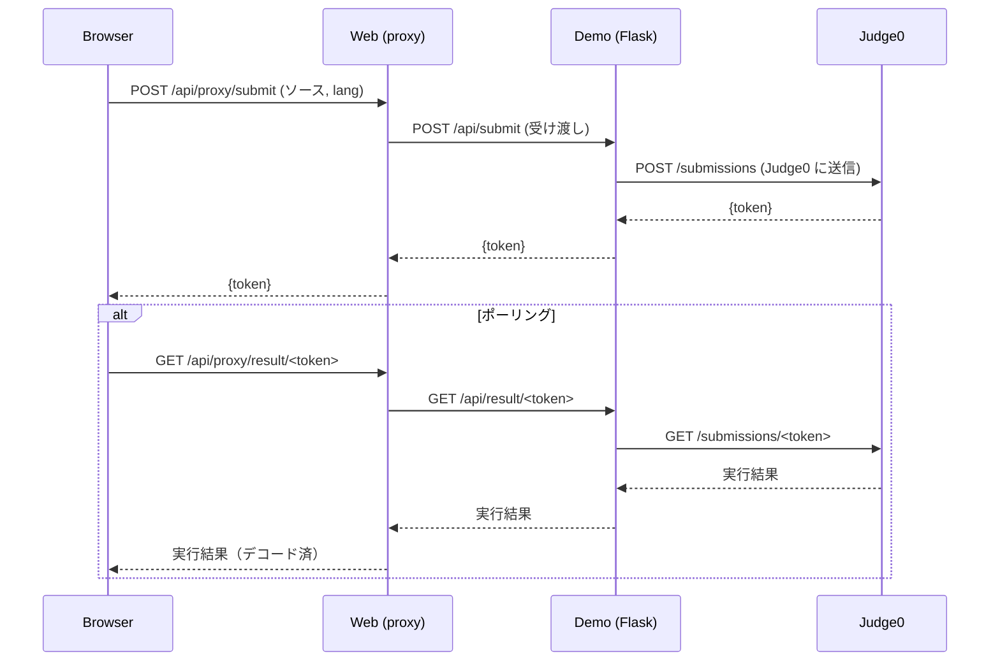
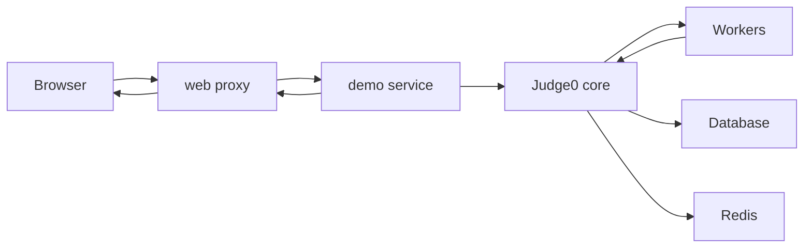

# Judge0 Demo — ローカル起動ガイドとアーキテクチャ

このリポジトリは、Judge0（オンラインジャッジコア）を使ったローカルデモ環境です。ブラウザからコードを送信し、Judge0 で実行して結果を確認するまでの一連の流れを Docker Compose で再現します。

この README では:
- プロジェクト概要
- コンポーネント構成と通信フロー（Mermaid 図）
- クイックスタート（Docker とローカル実行）
- 各コンテナとポートの説明
- よくある問題と対処法
- 開発者向けメモ（`code/` の実行方法）

さらに詳しい `code/` 側の説明は `code/README.md` を参照してください。

**重要:** このリポジトリには複数の compose ファイルが含まれます。ルートの `docker-compose.yml` を使うと全体を、`judge0/` や `judge0_flask/` の設定は個別利用向けです。

**前提**
- Linux/macOS/Windows (WSL) に Docker と docker-compose（または Docker Compose v2）がインストールされていること
- 使用ポートが競合していないこと（デフォルト説明を参照）

**目次**
- 概要
- アーキテクチャ
- クイックスタート（Docker）
- ローカルで `code/` を動かす方法
- API とエンドポイント
- トラブルシューティング
- 開発・デバッグのヒント

**コンポーネント（短縮）**
- `judge0`：Judge0 core（評価エンジン）
- `judge0_flask`：Judge0 とやりとりするデモサーバ（Flask）
- `code`：フロントエンド＋同一オリジン proxy（Flask）

**主要ポート（デフォルト）**
- Judge0 core API: `2358`（内部サービス名 `server` または `judge0` によって異なる）
- Demo (judge0_flask): `5000`
- Web / Proxy (code): `5173`（静的/テンプレートはこのサービスで配信）

**アーキテクチャ図（Mermaid）**
以下は主要なリクエストフローを示す簡易図です。

```mermaid
graph LR
  Browser[Browser (ユーザ)] -->|提出: /api/proxy/submit| Web[web proxy (`code`)]
  Web -->|転送| Demo[demo service (`judge0_flask`)]
  Demo -->|Judge0 API| Core[Judge0 core]
  Core -->|実行ワーカー| Worker[Worker]
  Worker --> Core
  Core --> Database[(DB / 永続化)]
  Core --> Redis[(Redis / キュー等)]
  Demo -->|結果取得| Web
  Web -->|画面表示| Browser
```

シーケンス視点での簡易フロー（提出→結果取得）:



## クイックスタート（Docker Compose）
最も簡単な起動方法はルートの Compose を使う方法です。プロジェクトルートで実行します。

```bash
docker compose down
docker compose up -d --build
```

起動後、ブラウザで `http://localhost:5173` （またはプロジェクトの `docker-compose.yml` によるマッピングされたポート）を開いてください。

コンテナログを見るには:

```bash
docker compose logs --tail 200 --follow judge0 judge0_flask code
```

## `code/` をローカルで実行する（開発用）
開発中に `code/` の Flask プロキシだけをローカルで動かしたい場合の手順:

```bash
cd code
python3 -m venv .venv
source .venv/bin/activate
pip install -r requirements.txt
FLASK_APP=app.py FLASK_ENV=development flask run --host=0.0.0.0 --port=5173
```

注意点:
- この状態で `code` は Docker ネットワーク内のサービス名（例: `demo:5000` や `server:2358`）にアクセスする設定になっています。ローカル実行時は `judge0_flask` や `Judge0` を同じホストで動かすか、`code/app.py` の `target` URL を `http://localhost:5000` 等に書き換えてください。

## 主な API（概要）
- `POST /api/proxy/submit` — ブラウザから提出を受け取る。同一オリジン proxy を介して `judge0_flask` に転送。
- `GET /api/proxy/languages` — Judge0 の言語一覧を取得（フロントの言語選択に使用）。
- `GET /api/proxy/result/<token>` — 実行結果を取得。レスポンス内の `stdout`/`stderr` 等を自動で Base64 デコードして `decoded_stdout` 等を追加する仕組みあり。

## よくある問題と対処法
- CORS エラー: ブラウザが直接 Judge0 にアクセスしている場合は proxy を使ってください（`/api/proxy/*`）。
- Base64 デコードエラー: Judge0 が UTF-8 に変換できないバイナリを返す場合、`base64_encoded=true` を付与してエンコードされたデータを扱います。
- タイムアウト: 大きな入力や無限ループのテストでタイムアウトすることがあります。Compose 内のタイムアウト設定や Judge0 の `max_cpu_time` などを調整してください。

## 開発・デバッグのヒント
- ローカルで個別サービスを起動して、ネットワーク名（例: `demo`, `server`）を意識してテストするとトラブルシュートが速いです。
- `code/app.py` は `requests` があればそれを使い、なければ `urllib` にフォールバックします。環境に `requests` を入れると動作が安定します。

## 変更履歴と注記
- 詳細な変更点や作業ログは `docs/` に追加してください。簡単な差分は `judge0_flask/README.md` や `code/README.md` にまとめています。

---
もしこの README の内容に追加したい情報（例えば、CI 手順、詳細な Judge0 設定例、セキュリティ注意点など）があれば教えてください。修正して反映します。

# Judge0 Demo — 起動と使い方

このリポジトリは Judge0 を用いた Ace エディタのローカルデモです。ブラウザからコードを送信して Judge0 で実行する構成をローカルで動かせます。

## 目次
- 概要
- クイックスタート
- サービスとポート
- フロントエンドとプロキシ
- API
- よくある問題と対処法
- ログの確認方法
- 変更点
- アーキテクチャ図

## 概要
Docker Compose で Judge0 core、demo（Flask）、web（フロント＋proxy）を起動し、ブラウザは同一オリジンの proxy 経由で提出します。

## 前提条件
- Docker と docker compose がインストールされていること
- 使用するポートが空いていること（デフォルト: 2358, 5000, 5173/5174）

## クイックスタート
1. ビルドと起動:

docker compose down && docker compose up -d --build

2. ブラウザで開く:

http://localhost:5174

3. エディタにコードを入力して実行し、結果を確認する

## サービスとポート
- Judge0 core: 2358
- demo (Flask): 5000
- web (フロントエンド / proxy): 5173/5174

主要実装:
- デモサーバ: [`judge0_flask/app.py`](judge0_flask/app.py:1)
- proxy: [`code/app.py`](code/app.py:1)
- フロント: [`code/templates/index.html`](code/templates/index.html:1)

## フロントエンドとプロキシ
web が同一オリジン proxy を提供し、ブラウザは /api/proxy/* を通して提出します。これにより CORS による失敗を防ぎます。

## 主な API
- POST /api/proxy/submit — ブラウザ -> web -> demo -> Judge0
- GET  /api/proxy/languages — 言語一覧を取得
- POST /api/submit — demo が Judge0 に送るエンドポイント
- GET  /api/result/<token> — 実行結果（stdout/stderr をデコード済みで返す）
- POST /api/callback — Judge0 の callback を受け取る

## よくある問題と対処法
- CORS / Failed to fetch
  - 原因: ブラウザが直接他オリジンへアクセスしている
  - 対処: web の proxy を使う（/api/proxy/*）

- base64 エラー（Judge0 からの 400 例）
  - 例: {"error":"some attributes for this submission cannot be converted to UTF-8, use base64_encoded=true query parameter"}
  - 対処: 該当フィールドを base64 エンコードして、query に base64_encoded=true を付ける

- Judge0 のエラー透過
  - demo は Judge0 のエラー JSON と HTTP ステータスをそのまま返す実装です

## ログの確認方法
- コンテナログ確認:

docker compose logs --tail 200 demo web

- 詳細は [`judge0_flask/app.py`](judge0_flask/app.py:1) のログ出力を参照

## 変更点（主なファイル）
- [`judge0_flask/app.py`](judge0_flask/app.py:1) — 詳細ログ、base64 ヘルパ、Judge0 エラー透過
- [`code/app.py`](code/app.py:1) — proxy 実装
- [`code/templates/index.html`](code/templates/index.html:1) — 言語取得と提出修正
- [`docs/ai_status.md`](docs/ai_status.md:1) — 作業履歴
- [`setup.cfg`](setup.cfg:1) — flake8 設定

## アーキテクチャ図
下図は主要コンポーネントと通信フローを示します。



## 最後に
README に追加したい点や表現の修正があれば指示してください。最終版を反映します。