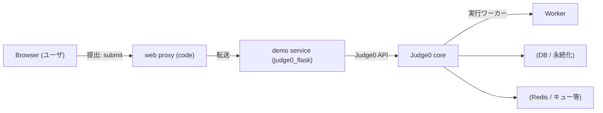

# Judge0 Demo — ローカル起動ガイドとアーキテクチャ

このリポジトリは、Judge0（オンラインジャッジコア）を使ったローカルデモ環境です。ブラウザからコードを送信し、Judge0 で実行して結果を確認するまでの一連の流れを Docker Compose で再現します。

この README では:
- プロジェクト概要
- コンポーネント構成と通信フロー（Mermaid 図）
- クイックスタート（Docker とローカル実行）
- 各コンテナとポートの説明
- よくある問題と対処法
- 開発者向けメモ（`code/` の実行方法）

さらに詳しい `code/` 側の説明は `code/README.md` を参照してください。

**重要:** このリポジトリには複数の compose ファイルが含まれます。ルートの `docker-compose.yml` を使うと全体を、`judge0/` や `judge0_flask/` の設定は個別利用向けです。

**前提**
- Linux/macOS/Windows (WSL) に Docker と docker-compose（または Docker Compose v2）がインストールされていること
- 使用ポートが競合していないこと（デフォルト説明を参照）

**目次**
- 概要
- アーキテクチャ
- クイックスタート（Docker）
- ローカルで `code/` を動かす方法
- API とエンドポイント
- トラブルシューティング
- 開発・デバッグのヒント

**コンポーネント（短縮）**
- `judge0`：Judge0 core（評価エンジン）
- `judge0_flask`：Judge0 とやりとりするデモサーバ（Flask）
- `code`：フロントエンド＋同一オリジン proxy（Flask）

**主要ポート（デフォルト）**
- Judge0 core API: `2358`（内部サービス名 `server` または `judge0` によって異なる）
- Demo (judge0_flask): `5000`
# Judge0 Demo — ローカル起動ガイドとアーキテクチャ

このリポジトリは Judge0（オンラインジャッジコア）を使ったローカルデモ環境です。ブラウザからコードを送信し、Judge0 で実行して結果を確認するまでの一連の流れを Docker Compose で再現します。

目次
- 概要
- コンポーネント構成
- クイックスタート（Docker）
- `code/` をローカルで実行する方法（開発用）
- 主な API
- トラブルシューティング
- ログ確認
- 補足（開発ヒント・変更履歴）

概要
- `judge0`（Judge0 core）、`judge0_flask`（デモ Flask サービス）、`code`（フロント + 同一オリジン proxy）を組み合わせて動かします。

コンポーネント（短縮）
- `judge0`：Judge0 core（評価エンジン）
- `judge0_flask`：Judge0 とやりとりするデモサーバ（Flask）
- `code`：フロントエンド＋同一オリジン proxy（Flask）

主要ポート（デフォルト）
- Judge0 core API: `2358`（Compose 設定によりサービス名は `server` や `judge0` になる場合あり）
- Demo (judge0_flask): `5000`
- Web / Proxy (code): `5173`

アーキテクチャ図（簡易）



クイックスタート（Docker Compose）
1. プロジェクトルートで起動:

```bash
docker compose down
docker compose up -d --build
```

2. ブラウザで開く: `http://localhost:5173`

3. エディタからコードを送信して結果を確認します。

コンテナログ確認例:

```bash
docker compose logs --tail 200 --follow judge0 judge0_flask code
```

`code/` をローカルで実行する（開発用）
1. `code` ディレクトリへ移動し仮想環境を作成、依存をインストール:

```bash
cd code
python3 -m venv .venv
source .venv/bin/activate
pip install -r requirements.txt
pip install requests  # 任意（HTTP クライアント）
```

2. Flask を起動:

```bash
FLASK_APP=app.py FLASK_ENV=development flask run --host=0.0.0.0 --port=5173
```

注意: `code/app.py` は Docker ネットワーク内のサービス名（例: `http://demo:5000` や `http://server:2358`）を参照します。ローカル実行時は `judge0_flask` を同一ホストで起動するか、`app.py` の `target` を `http://localhost:5000` 等へ書き換えてください。

主な API（概要）
- `POST /api/proxy/submit` — ブラウザから提出を受け取り、`judge0_flask` に転送します。
- `GET /api/proxy/languages` — Judge0 の言語一覧を取得します。
- `GET /api/proxy/result/<token>` — 実行結果を取得します（`stdout`/`stderr` 等は自動的にデコードされる場合があります）。

トラブルシューティング（よくある問題）
- CORS エラー: ブラウザが直接 Judge0 にアクセスしている場合は `/api/proxy/*` 経由で提出してください。
- Base64 関連: Judge0 が非 UTF-8 のバイナリを返す場合、`base64_encoded=true` を利用してください。
- タイムアウト: 長時間実行するテストはタイムアウトの可能性があります。Judge0 の制限（`max_cpu_time` 等）を確認してください。

補足（開発ヒント・変更履歴）
- `code/app.py` は `requests` があればそれを優先使用します。
- 詳細や作業ログは `docs/`、サービス別の README はそれぞれのディレクトリ（例: `judge0_flask/README.md`, `code/README.md`）を参照してください。

ご要望があれば CI 設定例、Judge0 の詳細 config サンプル、セキュリティ注意点などをこの README に追加します。