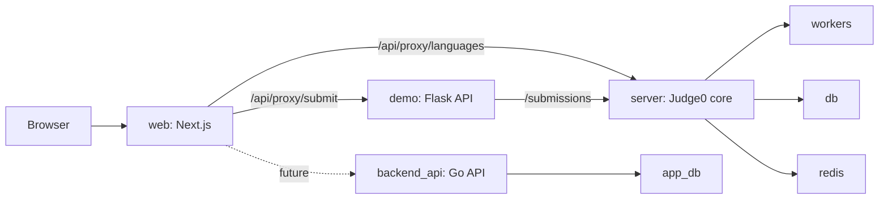

# Judge0 Demo - Next.js フロントエンド版

このリポジトリは、Judge0 を使ったローカルオンラインジャッジ環境です。ブラウザの画面は Next.js + React、Judge0 連携 API は Flask、実行基盤は Judge0 core / worker / PostgreSQL / Redis で構成します。

## コンポーネント

- `server`: Judge0 core API
- `workers`: Judge0 の実行 worker
- `db`: Judge0 専用 PostgreSQL
- `app_db`: 自作オンラインジャッジ本体のメタ情報用 PostgreSQL
- `redis`: Judge0 と demo 用 Redis
- `demo`: `judge0_flask/`。Judge0 へ提出し、結果を保存・取得する API
- `web`: `frontend/`。Next.js + React のフロントエンドと同一オリジン proxy
- `backend_api`: `backend/`。Go の Web API
- `judge_worker`: `backend/`。Go の採点 worker。現時点では `StubSandbox`

## 通信フロー


```mermaid
graph LR
  Browser["Browser"] --> Web["web: Next.js"]
  Web -->|/api/proxy/submit| Demo["demo: Flask API"]
  Web -->|/api/proxy/languages| Core["server: Judge0 core"]
  Demo -->|/submissions| Core
  Core --> Worker["workers"]
  Core --> DB["db"]
  Core --> Redis["redis"]
  Web -.future.-> Backend["backend_api: Go API"]
  Backend --> AppDB["app_db"]
```

Next.js 側に proxy を置く理由は、ブラウザから Docker 内部の `demo` や `server` を直接見せず、CORS も避けるためです。UI は React component、通信境界は Next.js Route Handler、Judge0 連携は Flask API という分担にしています。

## 起動

```bash
docker compose down
docker compose up -d --build
```

ブラウザで開く URL:

```text
http://localhost:5174
```

初回起動時、`web` コンテナ内で `npm install` が走ります。

## 主な API

- `POST /api/proxy/submit`
- `GET /api/proxy/languages`
- `GET /api/proxy/result/<token>`

これらは Next.js の `app/api/proxy/*/route.ts` にあり、内部サービスへ転送します。

## 開発メモ

Next.js フロントエンドの設計メモは [frontend/ARCHITECTURE.md](frontend/ARCHITECTURE.md) にまとめています。

ローカルで Next.js だけを動かす場合は、先に `demo` と Judge0 を起動し、`frontend/` で以下を実行します。

```bash
cd frontend
npm install
DEMO_URL=http://localhost:5000 JUDGE0_URL=http://localhost:2359 npm run dev -- --hostname 0.0.0.0 --port 3000
```

このリポジトリの環境では Docker Compose で動かすのが一番簡単です。

## 実機 / Cloudflare Tunnel で公開する場合

公開時は Next.js の開発サーバーではなく production server を使います。開発サーバーのまま公開すると `/_next/webpack-hmr` の WebSocket が 502 になり、ブラウザ console に HMR エラーが出ます。

```bash
docker compose -f docker-compose.yml -f docker-compose.prod.yml up -d --build
```

Cloudflare Tunnel は `web` の公開ポートに向けます。

```text
http://localhost:5174
```

## Go バックエンド

Go バックエンドの設計と起動方法は [backend/README.md](backend/README.md) にまとめています。
Judge0 用 `db` と自作アプリ用 `app_db` は分離しており、`backend/db/migrations` は `app_db` にだけ適用します。
